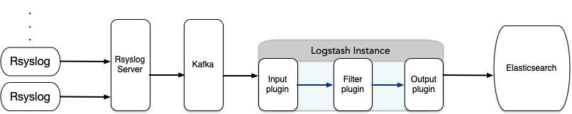

# 日志管理平台 ELK

## 前言
为了拓展日志管理的范围及规范化，参考了 pfelk 开源项目，新增并修改了一些应用程序过滤规则，开源出来。本项目配合 rsyslog 与 kafaka 联动进行日志管理，关联项目地址为 https://github.com/evling2020/rsyslog-kafka.git ，整体架构如下：


 
## 条件
- 服务器需安装 docker & docker-compose 即可

## 特色

- 日志格式主打 RCF5424 规范
- 日志处理过滤器模块化，便于规则管理
- 支持多种类型日志，包括系统日志、防火墙日志、nginx日志等
- 日志源默认从 kafka 消费数据，有其他情形的，自行更改

## 快速开始
```bash
git clone https://github.com/evling2020/syslog-elk.git
docker-compose up -d
```

## 日志对接
- 修改  `syslog-elk/logstash/syslog/conf.d/01-inputs.pfelk` 中日志源配置，我这里默认是 kafka 。 
- 修改 ES 密码，一是当前目录下 `.env` 中的环境变量，二是 `syslog-elk/logstash/syslog/conf.d/50-outputs.pfelk` 中的输出点


## 更新日志
- **2023.05.27:** 首次创建项目

## 易雾山庄

该项目是易雾山庄-家庭基建的一部分，[**易雾山庄**](https://www.evling.tech)记录了家庭网络基础建设的种种实践，可以帮助更多有需要的人减少折腾。希望通过这个平台构建一只家庭基建小社群，共同优化我们的生活体验，增强个人数据安全保护意识，同时我们还要考虑环保节能问题，实实在在帮大家伙组建属于自己的家庭网络。欢迎关注微信公号《易雾山庄》，订阅易雾君的独家折腾！！！

## 参考
- https://github.com/pfelk/pfelk
